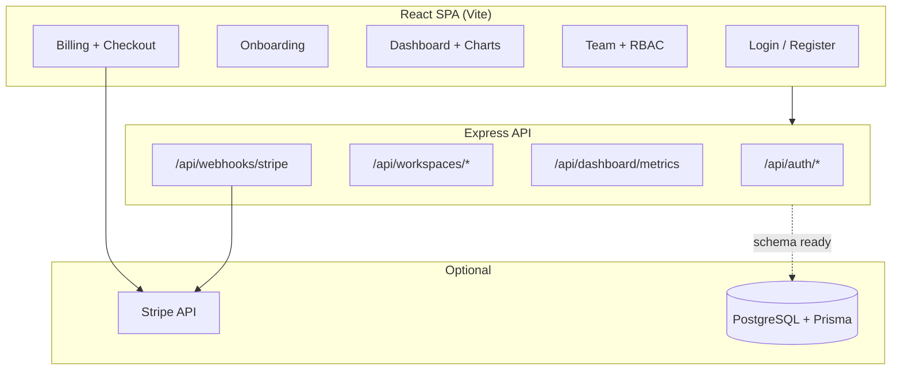

<div align="center">

# SaaS Dashboard

**Production-style multi-tenant admin console — auth, workspaces, analytics, and Stripe billing**

[](https://github.com/mkkbun/saas-dashboard/actions/workflows/ci.yml)
[](LICENSE)
[](https://nodejs.org/)
[](https://www.typescriptlang.org/)
[](https://react.dev/)
[](https://expressjs.com/)

[Live demo](#-quick-start) · [Features](#-highlights) · [Architecture](#-architecture) · [API](#-api-reference) · [Report bug](https://github.com/mkkbun/saas-dashboard/issues)

</div>

---

## Overview

Full-stack **SaaS management portal** showcasing patterns used in real B2B products: tenant isolation, role-based access, subscription tiers, audit logs, and payment webhooks. Built as a **portfolio-grade** reference implementation you can clone, run locally in one command, and extend.

> **Portfolio highlight:** Demonstrates end-to-end product thinking — from onboarding and workspace switching to MRR dashboards and Stripe checkout — not just UI components.

<table>
<tr>
<td width="50%">

### What it does

- Multi-workspace tenancy with sidebar switcher  
- `OWNER` / `ADMIN` / `MEMBER` RBAC  
- Onboarding wizard for new users  
- Recharts analytics (MRR, users, churn)  
- Stripe Checkout + webhook lifecycle  
- Simulated billing when Stripe is off  

</td>
<td width="50%">

### Built with

| Layer | Stack |
|-------|--------|
| UI | React 19, Tailwind CSS 4, Motion, Recharts |
| API | Express 4, TypeScript |
| Tooling | Vite 6, esbuild |
| Payments | Stripe SDK |
| Data model | Prisma schema (PostgreSQL-ready) |

</td>
</tr>
</table>

---

## Highlights

| Module | Capability |
|--------|------------|
| **Auth** | Register, sign-in, session restore, sign-out |
| **Onboarding** | Workspace naming and profile setup gate |
| **Multi-tenancy** | Multiple workspaces per user, active tenant context |
| **RBAC** | Role-gated team invites (Owner/Admin only) |
| **Analytics** | KPI cards, weekly charts, activity audit trail |
| **Billing** | Free / Pro / Enterprise tiers, checkout & webhooks |
| **Settings** | Profile, org name, account deletion |

---

## Quick start

```bash
git clone https://github.com/mkkbun/saas-dashboard.git
cd saas-dashboard
npm install
cp .env.example .env
npm run dev
```

Open **http://localhost:3000**

### Demo accounts

Password for all seed users: **`password123`**

| Email | Role | Workspace |
|-------|------|-----------|
| `admin@acme.com` | Owner | Acme (Pro plan) |
| `sarah@acme.com` | Admin | Acme |
| `ethan@acme.com` | Member | Acme (onboarding pending) |

New registrations automatically provision a personal **Free** workspace.

---

## Architecture



| Concern | Implementation |
|---------|----------------|
| **Runtime data** | In-memory store in `server.ts` (zero-config demos) |
| **Production path** | `prisma/schema.prisma` — users, workspaces, members, logs |
| **Sessions** | REST session API (demo: single process scope) |
| **Billing** | Real Stripe or `/billing/simulated-checkout` fallback |

<details>
<summary><strong>Project structure</strong></summary>

```text
saas-dashboard/
├── server.ts                 # API routes, webhooks, dev Vite middleware
├── prisma/schema.prisma      # Multi-tenant data model
├── src/
│   ├── App.tsx               # Layout, guards, navigation
│   ├── components/           # Feature views
│   └── lib/stripe.ts         # Plans & checkout helpers
└── .github/workflows/ci.yml  # Lint + build on every push
```

</details>

---

## API reference

<details>
<summary><strong>REST endpoints</strong></summary>

| Method | Endpoint | Description |
|--------|----------|-------------|
| `GET` | `/api/auth/session` | User, workspace, workspace list |
| `POST` | `/api/auth/signin` | Login |
| `POST` | `/api/auth/register` | Register + provision workspace |
| `POST` | `/api/auth/signout` | Logout |
| `POST` | `/api/onboarding/complete` | Complete onboarding |
| `POST` | `/api/workspaces/select` | Switch workspace |
| `GET` | `/api/dashboard/metrics` | KPIs, charts, activity |
| `POST` | `/api/workspace/members/invite` | Invite member |
| `POST` | `/api/billing/checkout` | Stripe or simulated checkout |
| `POST` | `/api/webhooks/stripe` | Subscription webhooks |
| `POST` | `/api/settings/update` | Update profile / org |
| `POST` | `/api/settings/delete-account` | Delete account |

</details>

---

## Configuration

| Variable | Required | Purpose |
|----------|----------|---------|
| `APP_URL` | No | Base URL for Stripe redirects |
| `STRIPE_SECRET_KEY` | No | Enables live Stripe checkout |
| `STRIPE_WEBHOOK_SECRET` | No | Verifies webhook signatures |
| `DATABASE_URL` | No | PostgreSQL when wiring Prisma |

See [`.env.example`](.env.example) for the full list.

### Stripe (optional)

```bash
stripe listen --forward-to localhost:3000/api/webhooks/stripe
```

Map price IDs in [`src/lib/stripe.ts`](src/lib/stripe.ts) to your Stripe products.

---

## Scripts

| Command | Description |
|---------|-------------|
| `npm run dev` | Dev server (Express + Vite) on port 3000 |
| `npm run build` | Production client + server bundle |
| `npm start` | Run production build |
| `npm run lint` | TypeScript check |

---

## Deployment

```bash
npm run build
NODE_ENV=production npm start
```

Deploy to [Vercel](https://vercel.com/), [Railway](https://railway.app/), [Render](https://render.com/), or any Node host. Set `APP_URL` and optional Stripe variables in the platform dashboard.

---

## Roadmap

- [ ] Wire Prisma to PostgreSQL (replace in-memory store)
- [ ] HTTP-only session cookies + JWT
- [ ] bcrypt password hashing
- [ ] Deploy public demo (Vercel / Railway)
- [ ] E2E tests (Playwright)

---

## Contributing

Contributions are welcome. Please open an [issue](https://github.com/mkkbun/saas-dashboard/issues) or [pull request](https://github.com/mkkbun/saas-dashboard/pulls).

---

## License

[Apache-2.0](LICENSE) — see [LICENSE](LICENSE) for details.

---

<div align="center">

**If this project helped you, consider starring the repo — it helps others discover it.**

Made with focus on clarity, real SaaS patterns, and portfolio presentation.

</div>
